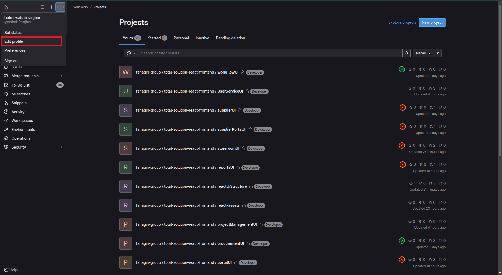
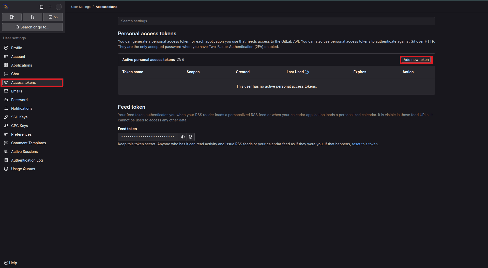
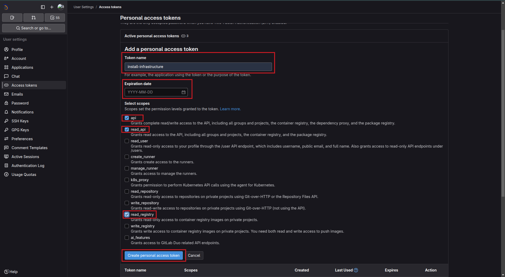
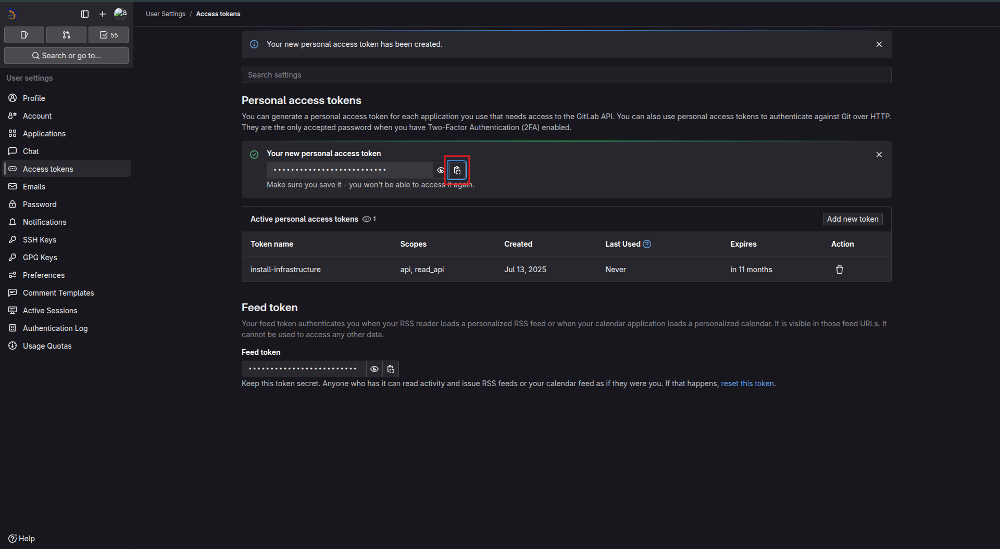

# نصب پکیج زیرساخت از طریق GitLab

برای نصب پکیج زیرساخت، می‌توانید از رجیستری GitLab استفاده کنید. مراحل زیر را دنبال نمایید:

---

## ۱. ورود به GitLab و ساخت توکن

ابتدا وارد حساب کاربری خود در GitLab شوید.  
سپس از منوی بالا سمت چپ ، گزینه‌ی **Edit profile** را انتخاب کنید.



### به تب **Access Tokens** بروید و روی **Add new token** کلیک کنید



### در فرم باز شده:

 یک **نام دلخواه** برای توکن وارد کنید.
 مقدار **Expiration date** را خالی کنید.
 گزینه‌های **api** و **read_api** را فعال نمایید.  
 سپس روی دکمه‌ی **Create personal access token** کلیک کنید.



### پس از ایجاد، توکن برای شما نمایش داده می‌شود.  
آن را کپی کرده و در جای امنی نگهداری کنید.



---

## ۲. ویرایش فایل `.npmrc` در پروژه

در ریشه‌ی پروژه‌، فایل .npmrc را باز کرده و محتوای زیر را به آن اضافه کنید:

```ini
//193.151.145.140:3003/api/v4/projects/156/packages/npm/:_authToken=your-token
@agin:registry=http://193.151.145.140:3003/api/v4/projects/156/packages/npm/
legacy-peer-deps=true
 ```

به جای your-token، توکنی را که در GitLab ایجاد کردید قرار دهید.

## ۳. نصب پکیج

ابتدا دستور clean cache رو بزنید
```
npm cache clean --force
```
اکنون می‌توانید با اجرای دستور زیر، پکیج را نصب کنید:

```
npm install --save @agin/react-ui-structure
```